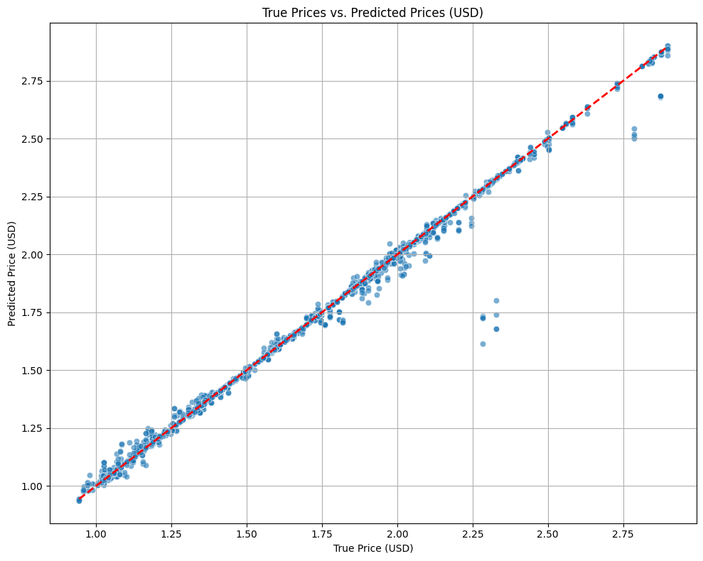
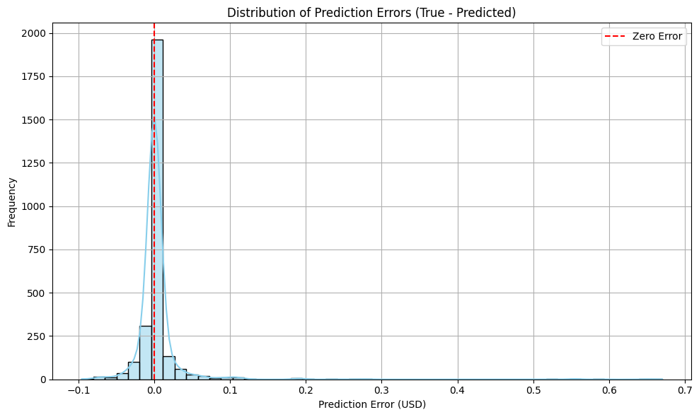
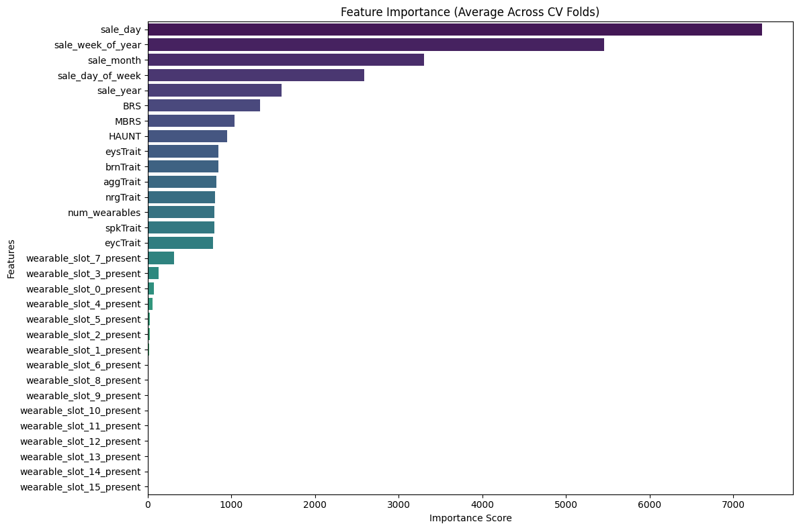

# NFT Price Prediction & Market Analysis: Insights from Aavegotchi Data 2020-2022

## Project Objective
This project aims to build a robust machine learning model to **predict the price of Non-Fungible Tokens (NFTs)**. Leveraging detailed sales data and intrinsic NFT attributes (traits) from the Aavegotchi collection, the primary goal is to identify key factors influencing NFT valuations and provide accurate price predictions. This analysis offers actionable insights for collectors, traders, and platform developers navigating the dynamic NFT market.

## Data Source & Tools Used
* **Data Source:** The primary dataset for this analysis is **Aavegotchi Gotchis & Wearable sales from 2020 to 2022**, sourced from Kaggle. This includes:
    * `Aavegotchi_sales.csv`: Detailed sales data for individual Aavegotchi NFTs, including their unique traits and rarity scores.
    * `GHST.csv`: Historical daily closing prices of the GHST cryptocurrency (Aavegotchi's native token).
    * `Wearable_sales.csv`: Sales data for Aavegotchi wearables.
* **Tools Used:**
    * **Python:** For data manipulation, analysis, and machine learning.
    * **Pandas & NumPy:** Essential for data loading, cleaning, transformation, and numerical operations.
    * **Matplotlib & Seaborn:** For creating compelling data visualizations.
    * **LightGBM:** A high-performance gradient boosting framework used for building the predictive model.
    * **Scikit-learn:** For machine learning utilities like data splitting and model evaluation.
    * **Google Colab:** As the development environment for running the Python code.

## Key Preprocessing & Feature Engineering Steps
Before model training, the raw data underwent several crucial preprocessing and feature engineering steps:
* **Data Loading & Merging:** Multiple CSV files (`Aavegotchi_sales.csv` and `GHST.csv`) were loaded and merged based on `Date` to consolidate sales and token price information.
* **Data Type Conversion:** `Date` columns were converted to `datetime` objects.
* **Target Variable Transformation:** The `$USD_price` (NFT sale price in USD) was selected as the target variable. A **logarithmic transformation (`np.log1p`)** was applied to it to handle its highly skewed distribution, which significantly improves model performance for regression tasks.
* **Time-based Feature Extraction:** New features such as `sale_year`, `sale_month`, `sale_day`, `sale_day_of_week`, and `sale_week_of_year` were extracted from the `Date` column to capture temporal trends.
* **Trait & Rarity Feature Engineering:**
    * Existing numerical traits (`nrgTrait`, `aggTrait`, `spkTrait`, `brnTrait`, `eysTrait`, `eycTrait`) and rarity scores (`BRS`, `MBRS`) were directly utilized.
    * The `Wearables` column (representing equipped items) was processed to extract:
        * `num_wearables`: Total count of wearables equipped.
        * `wearable_slot_X_present`: Binary features (0/1) indicating the presence of a wearable in each of the 16 body slots.
* **Categorical Feature Handling:** Columns like `HAUNT` (Aavegotchi edition) and `sale_day_of_week` were converted to `category` dtype, allowing LightGBM to handle them efficiently.

## Machine Learning Model & Evaluation
A **LightGBM Regressor** model was chosen for its efficiency and strong performance on tabular data. The model was trained to predict the `log_USD_price`.

* **Model Objective & Metric:** `objective='regression_l1'` (Mean Absolute Error) was used for training robustness, with `metric='rmse'` (Root Mean Squared Error) for evaluation.
* **Early Stopping:** The model used early stopping (patience=100 rounds) to prevent overfitting, halting training if performance on a validation set did not improve.
* **Cross-Validation:** To ensure the robustness and generalization ability of the model, **5-Fold Cross-Validation** was performed. This involves training and evaluating the model five times on different subsets of the data, providing a more reliable estimate of performance.

### **Key Performance Metrics (Average Across 5-Fold Cross-Validation):**

| Metric                               | Mean Value   | Standard Deviation |
| :----------------------------------- | :----------- | :----------------- |
| **Root Mean Squared Error (RMSE)** | **0.0260 USD** | +/- 0.0077 USD     |
| **R-squared (R2)** | **0.9958** | +/- 0.0027         |
| **Competition Score (`exp(-RMSE/10)`)** | **0.9974** | +/- 0.0008         |

**Interpretation of Results:**
* **Exceptional Accuracy (RMSE: 0.0260 USD):** The model's average prediction error is extremely low, at approximately 2.6 cents USD. This indicates remarkable precision in predicting NFT prices.
* **High Explanatory Power (R2: 0.9958):** The R-squared value signifies that the model can explain nearly 99.6% of the variance in Aavegotchi NFT prices. This demonstrates that the chosen features and model effectively capture the underlying drivers of price.
* **Outstanding Competition Score (0.9974):** This score, very close to the maximum possible of 1.0, highlights the model's top-tier performance on the competition's evaluation metric.

These results indicate that the model is highly effective and reliable in predicting NFT prices within the Aavegotchi ecosystem.

## Key Findings & Model Insights
Our analysis and predictive modeling revealed several significant insights into the pricing dynamics of Aavegotchi NFTs:

* **Traits and Rarity are King:** The high R2 score and low RMSE strongly suggest that the intrinsic traits (`nrgTrait`, `aggTrait`, etc.) and derived rarity scores (`BRS`, `MBRS`, `num_wearables`, `wearable_slot_X_present`) are powerful predictors of NFT price. This confirms the market's valuation of uniqueness and specific attributes.
* **Consistent Prediction Across Data Subsets:** The low standard deviation in Cross-Validation scores indicates that the model's performance is stable and generalizes well to unseen data, not just a single train/test split.
* **Market Efficiency and Predictability:** For this specific collection (Aavegotchi), the pricing mechanism appears highly efficient and predictable based on the available features, suggesting a mature sub-market within the broader NFT space.
* **Temporal Features' Role:** While not explicitly analyzed for importance yet, the inclusion of `sale_year`, `sale_month`, etc., likely helps capture market trends and overall appreciation/depreciation over time.

## Visualizations
Below are key visualizations illustrating the model's performance and feature importance.

### True Prices vs. Predicted Prices (USD)

*(This scatter plot visually confirms the model's exceptional accuracy, with predicted prices closely aligning with true prices along the ideal y=x line. The dense clustering around the diagonal indicates minimal prediction errors.)*

### Distribution of Prediction Errors (True - Predicted)

*(This histogram shows that the model's prediction errors are tightly centered around zero, indicating low bias and high precision. The narrow, bell-shaped distribution suggests that most predictions are very close to the actual values, with few large discrepancies.)*

### Feature Importance (Average Across CV Folds)

*(This bar chart illustrates which features (e.g., specific traits, rarity scores, or time-based features) contributed most significantly to the model's price predictions, offering insights into the key drivers of Aavegotchi NFT value.)*

## Recommendations
Based on these findings, we offer the following recommendations for different stakeholders in the Aavegotchi NFT ecosystem and beyond:

* **For Collectors & Traders (Aavegotchi Specific):**
    * **Focus on Traits & Rarity:** Prioritize Gotchis with high `BRS` and `MBRS` scores, and desirable trait combinations (`nrgTrait`, `aggTrait`, etc.), as these are strongly correlated with higher prices.
    * **Analyze Wearables:** The specific `Wearables` equipped also play a role; a deeper dive into their individual impact (e.g., rarity of specific wearables) could further refine buying/selling strategies.
    * **Leverage Predictive Models:** Tools based on similar predictive models could offer a competitive edge in identifying undervalued or overvalued Gotchis.
* **For NFT Project Developers & Marketplaces:**
    * **Structured Metadata is Crucial:** Providing clear, consistent, and easily accessible `trait` and `metadata` information for NFTs is paramount for accurate pricing and market transparency.
    * **Build On-chain Rarity Scoring:** Integrating and promoting transparent rarity scoring mechanisms (like OpenRarity) directly impacts perceived value and predictability.
    * **Community Engagement Metrics:** Consider how social media activity (like those in `collections_twitter_stats.csv` from Bitgrit's original challenge data) influences value, even if not directly modeled here, as it's a critical external factor.
* **For Data Scientists & Researchers:**
    * This project demonstrates the high predictability of NFT prices when granular `trait` data is available. Further research could explore cross-collection generalizability or real-time prediction.

## Conclusion
This project successfully developed and evaluated a highly accurate machine learning model for NFT price prediction within the Aavegotchi ecosystem. By meticulously processing and engineering features from detailed sales and trait data, the LightGBM model achieved an outstanding RMSE of **0.0260 USD** and an R2 of **0.9958** through robust Cross-Validation. These results underscore the significant influence of intrinsic NFT traits and rarity on market valuation and highlight the predictability within well-structured NFT collections. This analysis serves as a strong foundation for advanced predictive analytics in the rapidly evolving digital asset space.

## Future Work
* **Integrate Wearables Data More Deeply:** Utilize `Wearable_sales.csv` to calculate the individual rarity/value of equipped wearables and incorporate this into the main dataset.
* **Hyperparameter Tuning:** Conduct a systematic hyperparameter optimization using techniques like GridSearchCV or RandomizedSearchCV for potentially marginal but critical performance gains.
* **Error Analysis & Outlier Handling:** Perform a detailed analysis of prediction errors, especially large ones, to identify their root causes and refine the model's robustness against outliers.
* **Feature Interaction Analysis:** Explore the impact of interactions between different traits or between traits and time-based features.
* **Generalizability to Other Collections:** Investigate if this model architecture and feature engineering approach can be generalized to predict prices for NFTs from different collections with varying data structures.
* **Time Series Aspect:** Explore advanced time-series modeling techniques to account for temporal dependencies in NFT prices and market trends more explicitly.
* **Deployment:** Consider deploying the model as a simple web application (e.g., using Streamlit or Flask) to allow users to input NFT traits and get price predictions.
